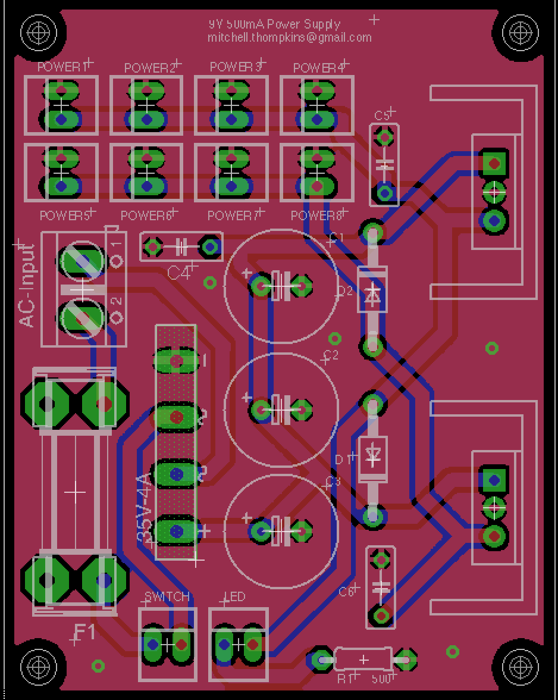

## Description
This is a low-cost pedal board power supply for any standard pedal board requiring 9V. It supplies 9V to 8 ports and has a maximum current capacity of 500mA. It takes a standard US 120V 60Hz input and the circuit is protected by a 5x20mm 250VAC 2A fuse. PSpice simulations are also included.

### Current revision of the PCB:

